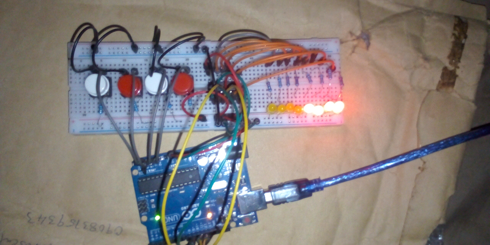

# LED Chaser with 595 Shift Register - ARDUINO PROJECT

## Overview
This project demonstrates how to control multiple LEDs using a 74HC595 shift register and Arduino. Four push buttons are used to select different LED chase patterns, allowing multiple lighting effects to be displayed using only three Arduino output pins.

## Objective
- Learn how to interface a 74HC595 shift register with Arduino  
- Reduce GPIO pin usage using serial-to-parallel conversion  
- Create multiple LED chase patterns  
- Use push buttons to control pattern selection  
- Understand bitwise LED pattern manipulation  

## Components Used
- Arduino Uno  
- 74HC595 Shift Register  
- LEDs × 8  
- Push buttons × 4  
- 220Ω resistors  
- Breadboard  
- Jumper wires  
- 9V Battery  
- 9V Battery Clip to DC Barrel Jack  

## Circuit Diagram

[CLICK HERE FOR MORE IMAGES](images/)

## How It Works
1. The Arduino communicates with the 74HC595 shift register using three pins:
   - Data pin  
   - Clock pin  
   - Latch pin  
2. The shift register outputs control the ON/OFF state of 8 LEDs simultaneously.  
3. Four push buttons are connected to the Arduino:
   - Each button selects a different LED pattern.  
4. Available LED patterns include:
   - Left-to-right LED chase  
   - Right-to-left LED chase  
   - Alternating nibble pattern using MSB/LSB shifting  
   - Rotating bit pattern using bitwise operations  
5. When a button is pressed, the corresponding pattern is continuously displayed until another button is selected.  
6. `shiftOut()` is used to send data serially to the shift register, which then updates all LEDs at once.  

## Code
The Arduino sketch for this project is located in the [code/ directory](code/led_chaser_with_shift_register_595_project_on_9th_november_2025.ino).

## Demo Video
A demonstration video showing the working project is included in this repository.

📹 **Project Demonstration:**  
[Click here to watch/download the demo video](video/)

*(If the video does not preview directly on GitHub, please download it using the link above.)*

## Reflection (What I Learned)
- How shift registers expand Arduino output capability  
- Using `shiftOut()` with MSBFIRST and LSBFIRST  
- Designing multiple LED animation patterns  
- Handling button-based mode selection  

## Challenges Faced
- Managing pattern state transitions smoothly  
- Correctly resetting LED values during shifts  
- Timing LED animations with delays  

## Possible Improvements
- Add non-blocking timing using `millis()`  
- Display current pattern number on an LCD  
- Implement button debouncing  
- Add more complex LED animations  

## Project Status
Completed

